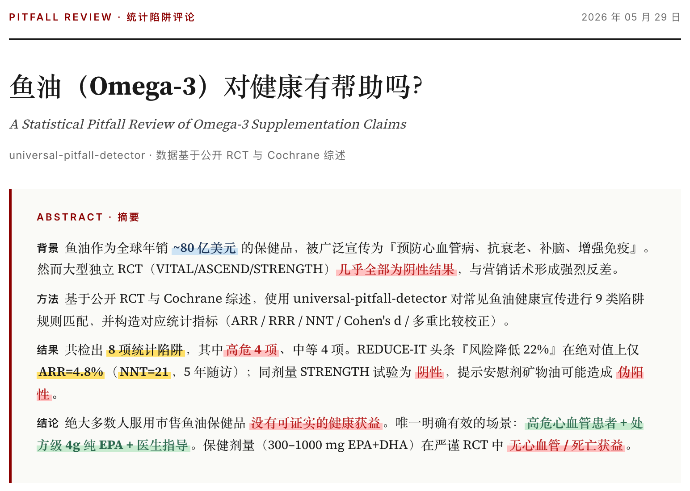
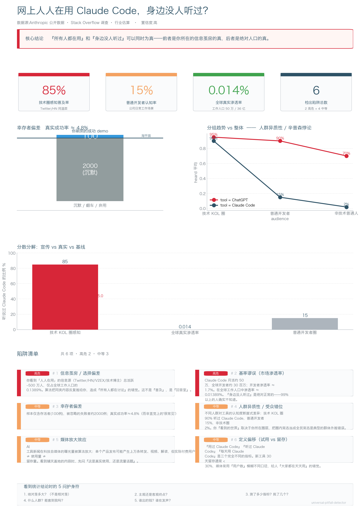
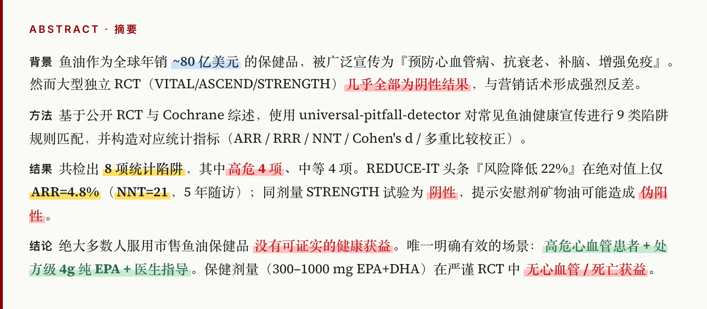
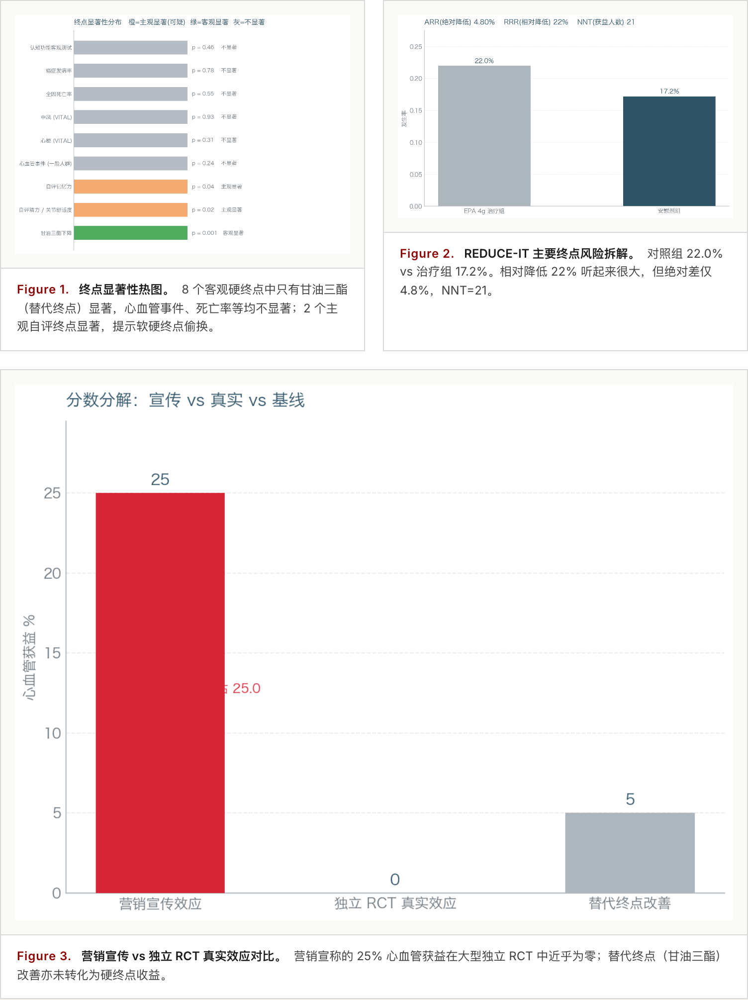
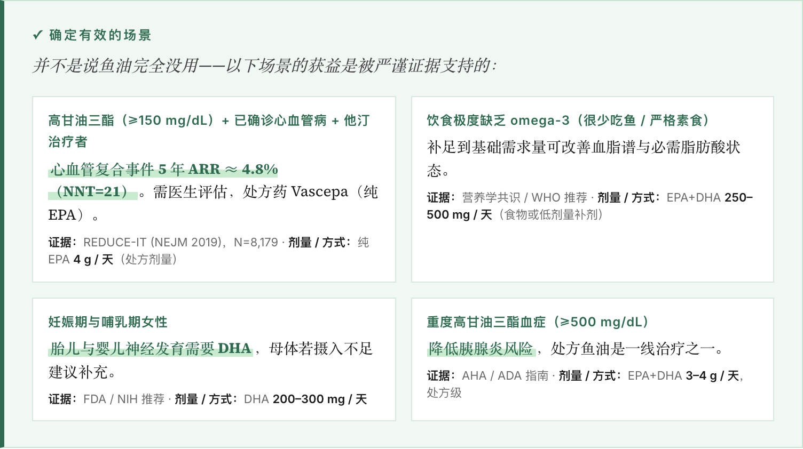
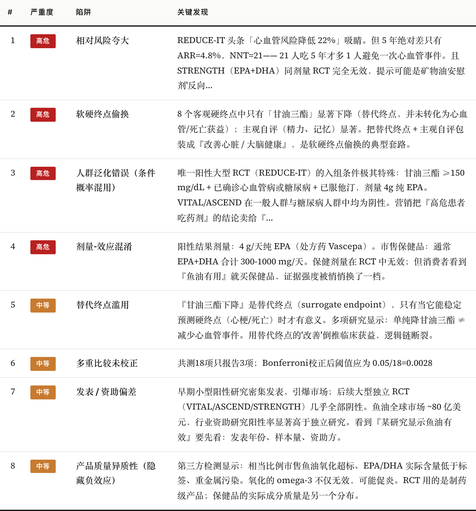
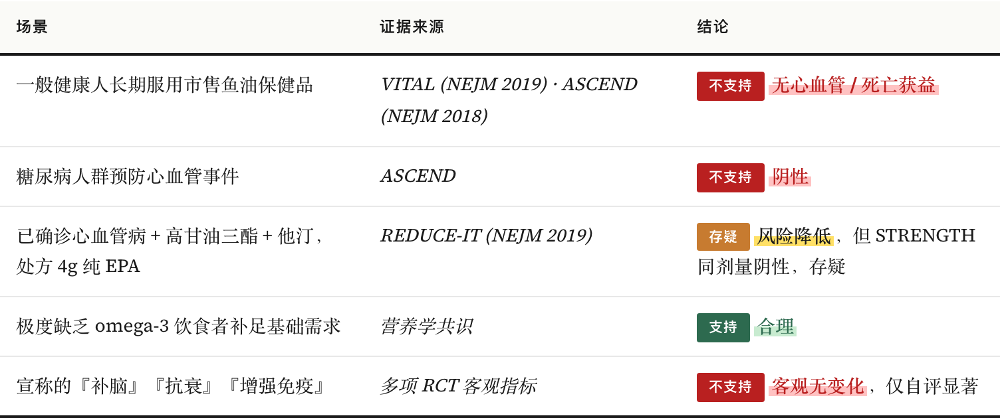
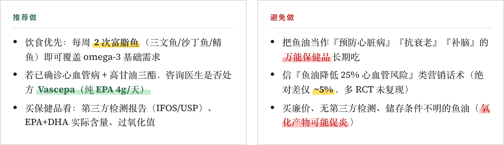
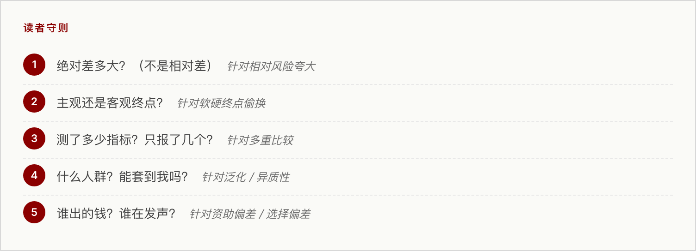

# Universal Pitfall Detector · 统计陷阱检测器

> 给「研究显示…」、「NN% 有效率」、「人人在用」这类论断装一个 BS 检测器。
>
> A bullshit detector for "studies show…", "NN% effective", and "everyone is using…" claims.

[English version below ↓](#english)

---

<a id="中文"></a>

## 这是什么

我做了一个 **Claude Code Skill**，专门用来发现生活中那些"听起来很有道理，其实是统计陷阱"的论断。它能识别 9 类常见陷阱：

> 辛普森悖论、幸存者偏差、相对风险夸大、软硬终点偷换、效应量微小、安慰剂效应未控制、基率谬误、选择偏差、数据污染、多重比较未校正。

输入是一个声明（"鱼油有效"、"维生素 B 提神"、"人人都在用 X"）+ 公开数据，输出是：

- **总览 dashboard**：标题 + 一句话结论 + KPI 卡片 + 核心证据图 + 陷阱卡片网格（适合截图分享）
- **学术杂志风格 HTML 报告**：双栏布局、IMRaD 摘要、关键结果荧光笔高亮、确定有效的场景、陷阱详解、5 问护身符
- **Markdown 报告**：适合贴 GitHub / Notion

它的核心理念是：**不只揭穿，也确认**。每份报告都有一个绿色调的「确定有效的场景」区段，列出经过严谨证据支持的有效场景，避免读者陷入"什么都没用"的虚无主义。

## 工作流

```
        ┌──────────────────────────────────────────┐
        │   原始声明 / 数据 / 文献                  │
        └──────────────────┬───────────────────────┘
                           ▼
        ┌──────────────────────────────────────────┐
        │   1. 数据接入                             │
        │   data_ingest · literature_search        │
        └──────────────────┬───────────────────────┘
                           ▼
        ┌──────────────────────────────────────────┐
        │   2. 统计指标 + 9 类陷阱规则匹配           │
        │   stat_analysis · causal_check ·         │
        │   pitfall_detector                       │
        │   ARR / RRR / NNT / Cohen's d / Bonferroni│
        └──────────────────┬───────────────────────┘
                           ▼
        ┌──────────────────────────────────────────┐
        │   3. 可视化                               │
        │   visualize · dashboard                  │
        │   终点热图 / 风险拆解 / 冰山图 /         │
        │   交叉线图 / 宣传 vs 真实                 │
        └──────────────────┬───────────────────────┘
                           ▼
        ┌──────────────────────────────────────────┐
        │   4. 多格式报告                           │
        │   报告.md  +  报告.html  +  dashboard.png │
        └──────────────────────────────────────────┘
```

## 案例展示

### 案例 1 · 鱼油（Omega-3）真的有用吗？

宣传："REDUCE-IT 试验显示鱼油降低 22% 心血管风险！"

我们的检测：8 项陷阱（4 高危 + 4 中等），核心包括相对风险夸大（绝对差 4.8%、NNT=21）、软硬终点偷换、人群泛化错误、剂量混淆。

但报告同时明确：处方级 4g 纯 EPA 在高危心血管病患者中是真实有效的，重度高甘油三酯血症、孕期 DHA、严格素食者也有明确证据支持。



🔬 [完整鱼油报告 → `examples/analyze_fish_oil.py`](examples/analyze_fish_oil.py)

### 案例 2 · 维生素 B 族

宣传："B 族提神抗疲劳！预防心脑血管！"

我们的检测：7 项陷阱。HOPE-2 / VITATOPS / SEARCH 等 N>5 万 RCT 显示心血管事件 ARR≈0；客观硬终点 5/5 不显著，仅替代终点（同型半胱氨酸）和主观自评显著。市售剂量常达 5000% RDA，B6 长期 >200 mg/天可致周围神经病变。

但 B12 缺乏症患者、孕期叶酸、严格素食/老年/胃酸抑制剂使用者的补充是有公共卫生级证据支持的。

🔬 [完整维生素 B 报告 → `examples/analyze_vitamin_b.py`](examples/analyze_vitamin_b.py)

### 案例 3 · "网上人人在用 Claude Code，身边没人听过"

这两句话能同时为真——前者是你所在信息茧房的真，后者是绝对人口的真。

我们的检测：6 项陷阱。Claude Code 在全球工作人口中渗透率仅 ~0.014%（50 万 MAU / 36 亿工作人口），但技术 KOL 同温层感知普及率 ~85%。两者相差 6000 倍。

报告同时确认：对重度命令行开发者、需要快速接手陌生代码库的工程师、独立开发者，Claude Code 是被实证的真实生产力放大器。



🔬 [完整回音室分析 → `examples/analyze_claude_code_bubble.py`](examples/analyze_claude_code_bubble.py)

## 报告长什么样

#### 摘要 · 关键结果用荧光笔高亮（黄/红/绿/蓝四色）



#### 双栏 figure grid · BI 风格



#### 「确定有效的场景」绿色调区段 · 平衡过度悲观



#### 陷阱速览表



#### 分场景结论表



#### 实操建议（推荐做 / 避免做）



#### 5 问护身符 · 看任何统计结论都能用



## 快速开始

```bash
git clone https://github.com/Faust-Donf/universal-pitfall-detector.git
cd universal-pitfall-detector

pip install -r requirements.txt
playwright install chromium    # 用于截图（可选）

# 跑三个旗舰案例
python examples/analyze_fish_oil.py
python examples/analyze_vitamin_b.py
python examples/analyze_claude_code_bubble.py

# 内置小案例
python run.py decision   # 幸存者偏差（创业成功率）
python run.py social     # 选择偏差 + 辛普森悖论
python run.py medical    # 软硬终点偷换
python run.py llm        # 大模型数据污染
```

## 当作 Claude Code Skill 使用

把整个目录复制到 `~/.claude/skills/universal-pitfall-detector/`，重启 Claude Code，
就可以这样调用：

> "用统计陷阱 skill 分析下『红酒每天一杯有益健康吗』"

Claude 会按 SKILL.md 的工作流自动跑完：检测器 → 可视化 → 学术 HTML 报告。

## 文件结构

```
universal-pitfall-detector/
├── SKILL.md                          # Claude Code 入口
├── README.md                         # 你正在看
├── requirements.txt
├── run.py                            # 一键运行内置 demo
├── assets/
│   └── journal_template.html         # 学术杂志 HTML 模板
├── docs/screenshots/                 # README 所用截图
├── examples/                         # 旗舰 + 内置案例
├── references/
│   └── pitfall_rules.yaml            # 9 类陷阱规则库
└── scripts/
    ├── stat_analysis.py              # ARR / RRR / NNT / Cohen's d / 卡方
    ├── causal_check.py               # 辛普森 / 幸存者 / 贝叶斯
    ├── pitfall_detector.py           # 终点偷换 / 多重比较 / 数据污染
    ├── visualize.py                  # 5 种独立 panel
    ├── dashboard.py                  # 总览 dashboard 拼图
    ├── report.py                     # Markdown 报告
    ├── html_report.py                # 学术杂志 HTML 报告
    └── screenshot_html.py            # 用 Playwright 截 HTML 各区域
```

## 边界声明

- 仅作"警示性"分析，**不替代专业医学 / 统计 / 法律意见**
- 案例中的数据基于公开 RCT / Cochrane 综述 / 行业估算，部分场景为说明性构造
- 联网检索结果质量取决于信源；遇到争议结论建议查原文

## 致谢

灵感来自 Cochrane 综述写作规范、NEJM/JAMA 的视觉语言、以及《How to Lie with Statistics》、《Bad Pharma》、《Calling Bullshit》等书。

## License

MIT

---

<a id="english"></a>

## English

> A Claude Code Skill that detects common statistical pitfalls in everyday claims.

### What it does

This skill detects 9 classes of statistical pitfalls in claims like *"studies show…"*, *"NN% effective"*, *"everyone is using…"*:

> Simpson's paradox · survivorship bias · relative-risk inflation · soft-vs-hard endpoint switching · trivial effect size · uncontrolled placebo · base-rate fallacy · selection bias · data contamination · uncorrected multiple comparisons.

Given a claim ("fish oil works", "B vitamins boost energy", "everyone uses X") plus public data, it produces:

- **A shareable dashboard PNG** — title + one-line verdict + KPI cards + key evidence charts + pitfall card grid.
- **A journal-style HTML report** — two-column BI-style figure grid, IMRaD abstract with highlighter accents, a positive-findings section, pitfall details, and a "5-question shield" for readers.
- **A Markdown report** — for GitHub / Notion.

A core principle: **debunk and confirm**. Every report includes a green "Where it actually works" section, listing scenarios that *are* supported by rigorous evidence — to avoid the report sliding into nihilistic skepticism.

### Workflow

```
Raw claim/data → ingest → 9-class rule matching →
risk metrics (ARR/RRR/NNT/Cohen's d) → visualization →
multi-format report (md / html / png)
```

### Three flagship cases

1. **`analyze_fish_oil.py`** — REDUCE-IT's "22% relative risk reduction" headline turns out to be ARR=4.8% and NNT=21. STRENGTH (same dose) was negative. But Vascepa-grade EPA *does* help confirmed CVD patients with high triglycerides — that's clearly stated, with evidence.

2. **`analyze_vitamin_b.py`** — Large RCTs (HOPE-2, VITATOPS, SEARCH) show essentially zero CV/death benefit. Long-term high-dose B6 (>200 mg/d) carries neuropathy risk. Meanwhile B12 deficiency, prenatal folate, and at-risk groups are clearly affirmed.

3. **`analyze_claude_code_bubble.py`** — "Everyone uses Claude Code online" and "nobody around me has heard of it" are both true: ~85% perceived adoption inside the tech echo chamber vs. ~0.014% global penetration — a 6000× gap. The report still confirms genuine productivity gains for heavy CLI developers, code-base onboarding, and indie hackers.

### Quick start

```bash
git clone <repo-url>
cd universal-pitfall-detector
pip install -r requirements.txt
playwright install chromium    # optional, for screenshots

python examples/analyze_fish_oil.py
python examples/analyze_vitamin_b.py
python examples/analyze_claude_code_bubble.py
```

### Use as a Claude Code skill

Drop the directory into `~/.claude/skills/universal-pitfall-detector/`, restart Claude Code, and ask:

> "Use the pitfall-detector skill to analyze whether one glass of red wine a day is healthy."

Claude follows the workflow in `SKILL.md` end-to-end and produces dashboard + HTML + Markdown.

### Disclaimer

This is a *warning-light* tool — not a substitute for professional medical, statistical, or legal advice.
Data in examples is drawn from public RCTs, Cochrane reviews, and industry estimates; some figures are illustrative.

### License

MIT
